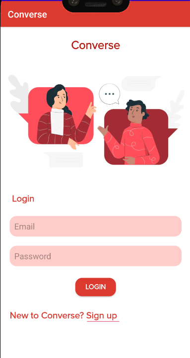
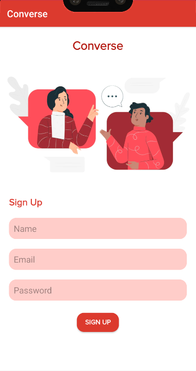
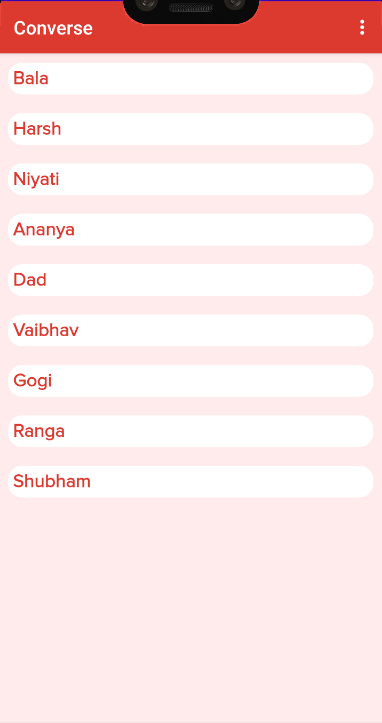

# Converse - The Chat App 📱

## Description 🗒️
Ideated an Android App which provides a platform to the users to have meaningful conversations with each other! 📧

## UI ✨

### Login Activity

### SignUp Activity

### Main Activity

### Chat Activity

## Tech stack 👨‍💻
Kotlin, XML, FireBase.

## Tool 📱
Android Studio
